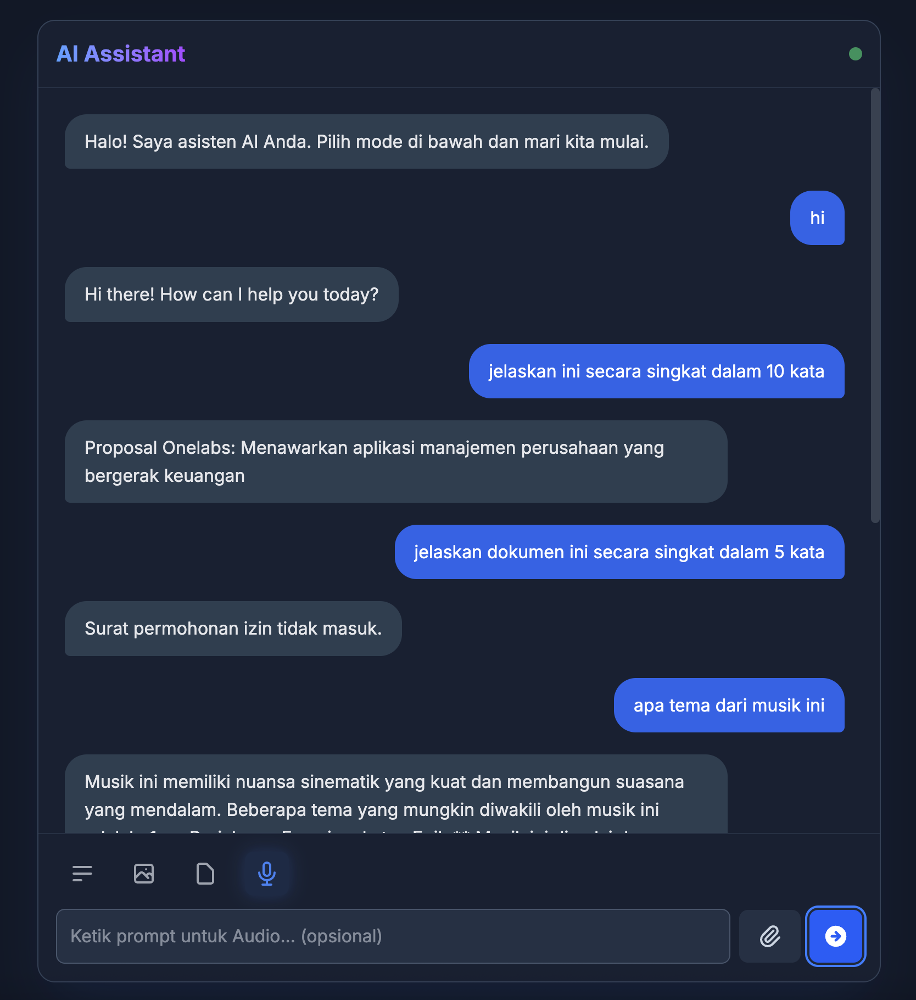

# Asisten AI Multi-Modal



Selamat datang di Asisten AI Multi-Modal! Ini adalah aplikasi web interaktif yang memungkinkan Anda berinteraksi dengan kecerdasan buatan (AI) dari Google (Gemini) melalui berbagai jenis input, termasuk teks, gambar, dokumen, dan suara. Aplikasi ini dirancang dengan antarmuka yang modern, aman, dan mudah digunakan.

## ✨ Fitur Utama

- **Interaksi Multi-Modal**: Beralih dengan mudah antara empat mode input yang berbeda:
  - **📝 Mode Teks**: Lakukan percakapan, ajukan pertanyaan, atau minta AI untuk menulis sesuatu.
  - **🖼️ Mode Gambar**: Unggah gambar dan minta AI untuk mendeskripsikan, menganalisis, atau menjawab pertanyaan tentang gambar tersebut.
  - **📄 Mode Dokumen**: Unggah dokumen (seperti PDF atau TXT) untuk diringkas atau dianalisis oleh AI.
  - **🎤 Mode Suara**: Unggah file audio untuk ditranskripsikan menjadi teks.
- **Antarmuka Modern**: Dibuat dengan tema ungu gelap dan biru yang kreatif menggunakan **Tailwind CSS v4**, memberikan pengalaman pengguna yang menyenangkan.
- **Akses Aman**: Dilengkapi dengan sistem autentikasi sederhana berbasis **4-digit PIN** untuk mencegah akses yang tidak sah.
- **Pengalaman Real-time**: Antarmuka seperti chatbot dengan indikator pengetikan (`...`) saat menunggu respons dari AI.

## 🚀 Teknologi yang Digunakan

Proyek ini dibagi menjadi dua bagian utama: frontend dan backend.

**Frontend:**
- **HTML5**: Struktur dasar aplikasi web.
- **Tailwind CSS v4**: Untuk styling antarmuka yang modern dan responsif (via CDN).
- **JavaScript (Vanilla)**: Menangani logika aplikasi, interaksi pengguna, dan komunikasi dengan backend.

**Backend:**
- **Node.js**: Lingkungan runtime JavaScript.
- **Express.js**: Kerangka kerja web untuk membangun API.
- **Google Gemini API (`@google/genai`)**: Untuk terhubung dengan model AI generatif dari Google.
- **Multer**: Middleware untuk menangani unggahan file (`multipart/form-data`).
- **`dotenv`**: Untuk mengelola variabel lingkungan seperti API key.

## 🛠️ Cara Menjalankan Proyek

Ikuti langkah-langkah berikut untuk menjalankan proyek ini di lingkungan lokal Anda.

### Prasyarat

- [Node.js](https://nodejs.org/) (versi 18 atau lebih baru direkomendasikan).
- API Key dari [Google AI Studio](https://aistudio.google.com/app/apikey).

### 1. Clone Repositori

```bash
git clone https://github.com/ibnusensei/nama-repositori-anda.git
cd nama-repositori-anda
```

### 2. Konfigurasi Backend

1.  **Install dependensi:**
    ```bash
    npm install
    ```

2.  **Buat file `.env`**: Buat file baru bernama `.env` di direktori utama dan tambahkan API Key Anda.

    ```env
    # Ganti dengan GEMINI API Key Google Gemini Anda
    GEMINI_API_KEY="YOUR_GOOGLE_API_KEY_HERE"
    ```

3.  **Jalankan server backend:**
    ```bash
    node index.js
    ```
    Server akan berjalan di `http://localhost:3000`.

### 3. Jalankan Frontend

1.  **Buka file `index.html`** langsung di browser pilihan Anda (Google Chrome, Firefox, dll).

2.  **Masukkan PIN**: Anda akan disambut oleh layar verifikasi. Masukkan 4-digit PIN yang benar.
    > 🔑 **Catatan**: PIN default adalah `1234`. Anda bisa mengubahnya di dalam file `script.js` pada variabel `CORRECT_PIN`.

3.  **Mulai Berinteraksi**: Setelah berhasil masuk, Anda dapat mulai menggunakan Asisten AI.

## 📂 Struktur Proyek

```
.
├── .gitignore         # Mengabaikan file seperti node_modules dan .env
├── index.html         # File utama antarmuka pengguna (Frontend)
├── style.css          # Gaya kustom tambahan
├── script.js          # Logika frontend, autentikasi, dan panggilan API
├── server.js          # Server backend (Express.js)
├── package.json       # Daftar dependensi dan skrip backend
└── README.md          # Dokumentasi ini
```

---
Dibuat dengan ❤️ oleh **ibnusensei**.